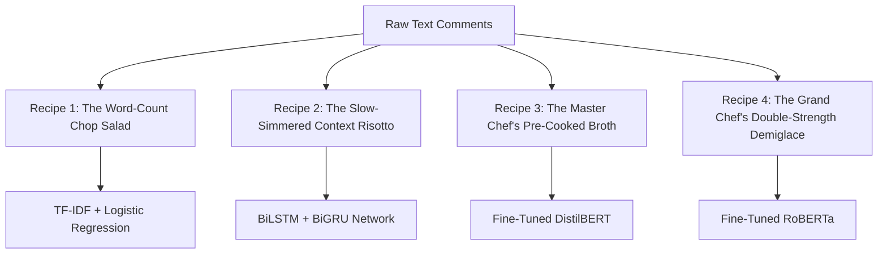

# 🍳 The Jigsaw Toxic Comment Kitchen: A Culinary NLP Guide

Welcome to the **Jigsaw Toxicity Kitchen**! Our mission is to inspect customer feedback (raw text comments) and detect **6 toxic contaminants**:
1. `toxic`
2. `severe_toxic`
3. `obscene`
4. `threat`
5. `insult`
6. `identity_hate`

To master this kitchen, we developed four recipes, progressing from a simple home-style salad to a master chef's ultimate signature dish.

---



---

## 🥗 Recipe 1: The "Word-Count Chop Salad"
### Model: TF-IDF + Logistic Regression

This recipe is a quick-prep cold salad. We don't care about the order in which the ingredients were tossed; we just chop them up, count them, and see if there is too much of a bad ingredient (like hot pepper or sour onions).

```
Prep Time: ~12 seconds
Tasting Score (Mean ROC-AUC): 0.9449
Complexity: Low 🟢
```

### 🧑‍🍳 Kitchen Steps

1. **Chop the Ingredients (Tokenization)**
   We slice the text comments into words ("word n-grams" like `"you"`, `"idiot"`, `"you idiot"`) and character pieces ("char n-grams" like `"idi"`, `"dio"`, `"iot"`). This is done using the [TfidfVectorizer](file:///c:/Users/Kevin%20Sukias/Downloads/my%20nlp%20models/tf_idf_results%20%281%29.ipynb#L46).
2. **Weigh the Dressing (TF-IDF Weighting)**
   If a word appears in almost every recipe in the kitchen (like `"the"`, `"is"`, `"a"`), it's like water—it has no flavor, so we give it a weight of zero. If a word is rare and sharp (like `"obscene"` or `"hate"`), it gets a heavy weight.
3. **Six Tasters (Logistic Regression Classifier)**
   We hire 6 line cooks ([Logistic Regression](file:///c:/Users/Kevin%20Sukias/Downloads/my%20nlp%20models/tf_idf_results%20%281%29.ipynb#L47)), one for each toxic label. Each cook samples the chopped salad, counts the bad pieces, and outputs a probability score from `0` to `1`.

> [!WARNING]
> **Chef's Critique**: Because we just "tossed" the salad, we lost the sequence context. This model cannot understand word ordering. For example, "not bad at all" and "bad, not at all" look identical to this recipe.

---

## 🍲 Recipe 2: The "Slow-Simmered Context Risotto"
### Model: Stacked BiLSTM + BiGRU Neural Network

Risotto requires constant stirring and attention to how flavors develop *over time*. This recipe tracks word sequences, learning how a comment's tone shifts from beginning to end.

```
Prep Time: ~15 minutes (on GPU)
Tasting Score (Mean ROC-AUC): 0.9538
Complexity: Medium-High 🟡
```

### 🧑‍🍳 Kitchen Steps

1. **Trimming and Prepping (Cleaning & Lemmatizing)**
   We clean the raw text using [preprocess_lstm](file:///c:/Users/Kevin%20Sukias/Downloads/my%20nlp%20models/lstm_results.ipynb#L214). Contractions are expanded (`"don't"` -> `"do not"`), and words are stripped to their base dictionary form (lemmatized) using a `WordNetLemmatizer` (e.g., `"obese"`, `"obesity"` -> `"obese"`). Stopwords are *kept* because "no" and "not" change sequence meaning!
2. **The Fixed-Size Cooking Pot (Padding)**
   We map words to integers and pad/truncate every comment to exactly 200 words. Any comment shorter than 200 is padded with zeros (empty water), and longer comments are sliced.
3. **Stirring the Pot (Model Architecture)**
   Defined in [build_bilstm](file:///c:/Users/Kevin%20Sukias/Downloads/my%20nlp%20models/lstm_results.ipynb#L375):
   * **Flavor Profiles (Embedding Layer)**: Translates simple word IDs into a 128-dimensional flavor profile vector.
   * **Dual Stirs (Bidirectional LSTM)**: One chef stirs the pot forward (start to end), and another stirs backward (end to start) to capture bidirectional context.
   * **Flavor Refinement (Bidirectional GRU)**: A second layer of chefs processes the LSTM output to extract higher-level context.
   * **Dual Tasting (Global Pooling)**: We grab the *strongest* spice note (Max Pooling) and blend it with the *average* background broth (Average Pooling).
   * **Plating (Sigmoid Classification)**: Served on a plate with 6 dipping cups representing our labels.

> [!CAUTION]
> **Risotto Disaster (Class Imbalance)**: Since toxic comments like "threats" represent only 0.29% of our data, the neural network got lazy and learned to output `0.00` for threats every time, resulting in an F1-Score of `0.00` for minority classes.

---

## 🥩 Recipe 3: The "Master Chef's Pre-Cooked Broth"
### Model: Fine-tuned DistilBERT (Transformer)

Instead of cooking from scratch, we source a Michelin-starred, pre-cooked baseline broth (pretrained DistilBERT) that has already spent millions of hours learning English grammar, context, and semantics. We just add our custom local spices (fine-tuning) to adapt it to toxic comments.

```
Prep Time: ~5 minutes (on GPU)
Tasting Score (Mean ROC-AUC): 0.9796 (🏆 Best)
Complexity: High 🔴
```

### 🧑‍🍳 Kitchen Steps

1. **Minimal Handling (BERT Tokenization)**
   Transformers expect natural language structure. We don't remove stopwords or lemmatize. We use [preprocess_bert](file:///c:/Users/Kevin%20Sukias/Downloads/my%20nlp%20models/bert_finetuned_jigsaw%20%281%29.ipynb#L2245) to clean URLs and format spaces, then feed it to the DistilBERT WordPiece Tokenizer.
2. **Multi-Head Attention (Flavor Interaction)**
   DistilBERT uses "Attention Heads". Think of this as 12 specialized culinary critics tasting different ingredient pairs simultaneously, instantly linking a toxic word at the beginning of a sentence to a pronoun at the very end.
3. **Differential Heat (Backbone vs. Head LR)**
   To avoid burning our delicate pretrained broth, we simmer the main DistilBERT backbone at a very low heat (learning rate `2e-5`). However, we sear our custom classification head at a higher heat (learning rate `2e-4`) to force it to adapt quickly.
4. **Extra Salt for Rare Dishes (Weighted Loss)**
   To fix the class imbalance problem from Recipe 2, we implement a weighted loss function in [ToxicDataset](file:///c:/Users/Kevin%20Sukias/Downloads/my%20nlp%20models/bert_finetuned_jigsaw%20%281%29.ipynb#L2589). We penalize missing a rare contaminant (like `threat` or `identity_hate`) up to **368 times more** than common ones.

> [!TIP]
> **Chef's Critique**: An exceptional transformer champion! Pretraining allowed the model to generalize with high accuracy, and weighted loss successfully recovered minority class metrics (threat F1 recovered from `0.00` to `0.18`).

---

## 🍯 Recipe 4: The "Grand Chef's Double-Strength Demiglace"
### Model: Fine-tuned RoBERTa (Transformer)

If Recipe 3 is a pre-cooked broth, Recipe 4 is a double-strength, long-simmered demiglace. Sourced from a much larger pantry of ingredients (10x more pretraining data) and slow-cooked for significantly longer, RoBERTa (`roberta-base`) is a heavier, more robust transformer with 125M parameters. We fine-tune it with differential learning rates to achieve maximum precision.

```
Prep Time: ~23 minutes (on GPU)
Tasting Score (Mean ROC-AUC): 0.9848 (🏆 Best)
Complexity: Very High 🔴
```

### 🧑‍🍳 Kitchen Steps

1. **Large Pantry Sourcing (160GB Pretraining Data)**
   RoBERTa has been trained on a massive 160GB corpus of natural language (compared to BERT's 16GB). This gives the model a much richer baseline vocabulary and semantic intuition before we even start fine-tuning.
2. **Dynamic Ingredient Prep (Dynamic Masking)**
   Unlike BERT, which masks the same words in every epoch (static masking), RoBERTa changes its masking patterns dynamically across training steps. This forces the model to learn a deeper understanding of context rather than memorizing fixed sentence patterns.
3. **No NSP (Next Sentence Prediction) Soup Strainer**
   RoBERTa completely discards BERT's Next Sentence Prediction task, focusing purely on sequence classification. By filtering out this extra noise, the model achieves a cleaner pretraining signal, allowing for superior generalization.
4. **VRAM Control & Heavy Simmering (Batch Size & Differential LR)**
   Because RoBERTa is a heavyweight model (125M parameters, double the size of DistilBERT), it requires more CPU/GPU memory. We cook it in smaller pots (Batch Size = 16 in [ToxicDataset](file:///c:/Users/Kevin%20Sukias/Downloads/my%20nlp%20models/roberta_finetuned_jigsaw.ipynb#L3183)) and apply differential learning rates in [AdamW](file:///c:/Users/Kevin%20Sukias/Downloads/my%20nlp%20models/roberta_finetuned_jigsaw.ipynb#L3258)—simmering the RoBERTa backbone (`model.roberta`) at `2e-5` and searing the classification head at `2e-4`.
5. **No Token Type IDs**
   Since the NSP task was dropped, RoBERTa has no need for segment embeddings (`token_type_ids`). This simplifies tokenization and sequence parsing in [ToxicDataset](file:///c:/Users/Kevin%20Sukias/Downloads/my%20nlp%20models/roberta_finetuned_jigsaw.ipynb#L3183).

> [!TIP]
> **Chef's Critique**: The new Michelin-star champion! Sourcing from a massive pretraining dataset and utilizing dynamic masking allows RoBERTa to achieve the highest scores, raising Mean ROC-AUC to `0.9848` and significantly improving minority class recognition (Threat F1-Score rises to `0.3529`).

---

## 📊 Summary of Kitchen Metrics

| Metric | Recipe 1: Salad (TF-IDF) | Recipe 2: Risotto (BiLSTM) | Recipe 3: Steak (DistilBERT) | Recipe 4: Demiglace (RoBERTa) |
| :--- | :---: | :---: | :---: | :---: |
| **Mean ROC-AUC** | 0.9449 | 0.9538 | 0.9796 | **0.9848** (🏆) |
| **Mean F1-Score** | 0.4877 | 0.4097 (⚠️) | 0.4896 | **0.5818** (✅) |
| **Threat F1-Score** | 0.0806 | 0.0000 (💔) | 0.1818 | **0.3529** (💖) |
| **Prep Complexity** | Minimal | Medium | Advanced | Extreme |

---

## 🔑 Key Terms & Glossary

Here are the definitions of special culinary techniques (NLP terms) used in our toxicity classification kitchen:

*   **TF-IDF (Term Frequency-Inverse Document Frequency)**: A statistical metric that scores how unique a word is to a specific comment compared to the rest of the dataset. It highlights distinctive words (sharp spices) and filters out common noise like "the" or "is".
*   **N-gram**: A contiguous sequence of $N$ tokens. Word n-grams capture multi-word expressions (e.g., "not toxic" is a 2-gram), while character n-grams capture word roots and spelling variants (e.g., "idiot" contains "idio", "diot").
*   **Lemmatization**: Slicing words back to their dictionary root form (e.g., "running", "ran", "runs" all reduce to "run"), ensuring the model counts them as the same ingredient.
*   **Word Embedding**: A culinary coordinate system (dense vector space) where words with similar flavors (meanings) are placed close together (e.g., "silly" and "stupid" end up adjacent).
*   **Spatial Dropout 1D**: A sequence-level safety valve. Instead of dropping random letters, it drops entire vocabulary dimensions across a sentence to make sure the network doesn't over-rely on specific keyword triggers.
*   **BiLSTM (Bidirectional Long Short-Term Memory)**: A recurrent layer that reads text forward and backward, maintaining a long-term "pot memory" of the conversation's context.
*   **BiGRU (Bidirectional Gated Recurrent Unit)**: A lighter recurrent layer that acts like a BiLSTM but has fewer knobs and gates, allowing it to cook much faster while retaining context.
*   **Global Pooling (Max vs. Average)**: Extracting features from a sequence: **Max Pooling** scoops the single most intense flavor spike (the worst word), whereas **Average Pooling** measures the overall average flavor profile.
*   **Class Imbalance**: An uneven ingredient distribution. With rare positive labels (like 46 threats out of 16,000 comments), the model can get lazy and guess "no threat" every time unless penalized.
*   **DistilBERT**: A distilled, lightweight version of the BERT transformer model. It has pre-trained culinary intuition (language model baseline) from reading the entire Wikipedia corpus.
*   **RoBERTa (Robustly Optimized BERT Approach)**: An optimized variant of the BERT transformer model. It has been pretrained on 10x more text data (160GB vs 16GB) and trained for longer with larger batches and no Next Sentence Prediction (NSP) task, achieving superior linguistic understanding.
*   **Dynamic Masking**: An advanced transformer training technique where the masking pattern is dynamically generated every time a sequence is passed to the model, preventing it from memorizing static patterns.
*   **Self-Attention**: A transformer mechanism that calculates how much focus a word should place on other words in the comment, dynamically finding semantic links (e.g. linking "hate" to "identity").
*   **Differential Learning Rates**: Simmering the base broth (DistilBERT) at low heat (learning rate `2e-5`) to keep it intact, while flash-frying the custom output classifier head at high heat (learning rate `2e-4`).
*   **Weighted Loss (Weighted BCE)**: Modifying binary cross-entropy loss to weight minority classes. Missing a positive threat is penalized 368 times more severely than missing a standard comment, correcting class imbalance.
*   **Mean Column-wise ROC-AUC**: Our main evaluation score. It calculates the probability that a randomly chosen toxic comment is scored higher than a clean comment across all 6 labels.
*   **F1-Score**: The balanced score between precision (how many flagged comments were actually toxic) and recall (how many toxic comments we successfully flagged). It prevents models from cheating by guessing majority classes.
